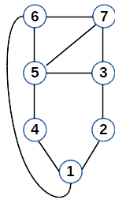
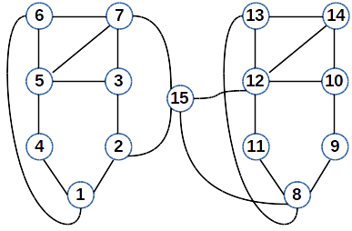
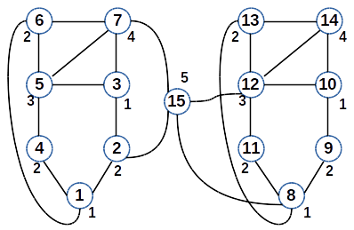
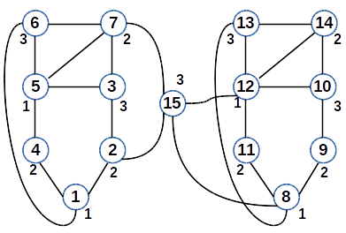

# Graph Exact Coloring Heuristic
## A Coloring Heuristic Based on Exact Coloring on Subgraphs

Welcome to the Graph Exact Coloring Heuristic project! This software computes a coloring heuristic based on exact coloring on subgraphs. 

The idea behind this project can be depicted using the following images:

*An initial graph which can be colored with an exact coloring algorithm or a heuristic*

*A graph which is built from the initial graph*

*A coloring with heuristics on the initial graph*

*A coloring with exact coloring on the initial graph*

This project is in active development, and contributions are welcome. For more information, please refer to the source code and comments therein.
