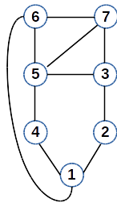
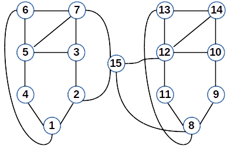
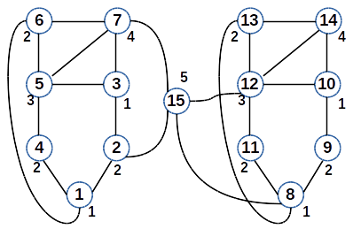
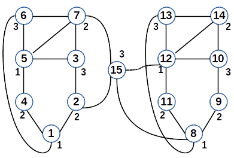

# Graph Coloring via Independent Sets

Two graph coloring algorithms implemented in C++17:

- **IS-based exact coloring** — computes the exact chromatic number via inclusion-exclusion over all independent sets (`is_exact_coloring/is_exact_coloring.h`)
- **IS-removal coloring** — a fast upper-bound heuristic that repeatedly peels off independent sets (`demo_is_removal_coloring.cpp`)

## Algorithms

### IS-Based Exact Coloring

The chromatic polynomial value at `k` is computed as:

```
c_k(G) = Σ_{V ⊆ V(G)} (-1)^|V| · α(V, F)^k
```

where `F` is the collection of all independent sets of `G` and `α(V, F)` counts the independent sets disjoint from `V`. The chromatic number χ(G) is the smallest `k` for which `c_k(G) ≠ 0`.

> **Note:** Exact but exponential-time — suitable for small graphs (up to ~14 vertices).

### IS-Removal Coloring

Repeatedly extracts an independent set (by iterating vertices in index order and removing each selected vertex and its neighbours), assigns it the next color, and repeats until no edges remain. Runs in O(n·m) time but may over-estimate χ(G).

## Dependencies

- Boost Graph Library ≥ 1.60 (`adjacency_list`, `dynamic_bitset`)
- GCC or Clang with C++17 support
- CMake ≥ 3.10
- OpenMP (optional, used by the hypergraph utility)

## Build

```bash
mkdir -p build && cd build
cmake ..
make
```

Produces two executables:

| Binary               | Source                        | Description                                      |
|----------------------|-------------------------------|--------------------------------------------------|
| `is_exact_coloring`  | `demo_is_exact_coloring.cpp`  | IS-based exact chromatic number for all graph families |
| `is_removal_coloring`| `demo_is_removal_coloring.cpp`| IS-removal coloring demo                         |
| `tests`              | `tests.cpp`                   | Runs the test suite and prints pass/fail counts  |

## Usage

```bash
# IS-based exact chromatic numbers for all graph families
./is_exact_coloring

# IS-removal coloring demo
./is_removal_coloring

# Run the test suite
./tests
```

Expected output from `./is_exact_coloring` (excerpt):

```
=== IS-Based Exact Coloring: chromatic numbers ===

Cycle graphs:
  C_3  (V=3, E=3)  chi=3
  C_4  (V=4, E=4)  chi=2
  ...
Generalized Petersen graphs:
  GP(5,2)  (V=10, E=15)  chi=3
  ...
```

## Results

The table below summarises every graph family covered by the test suite.
Timing was measured on a single core (Release build, Ubuntu 22.04).

### Correctness — all graph families

| Graph | Description | V | E | χ |
|---|---|:-:|:-:|:-:|
| C₃ | Triangle | 3 | 3 | 3 |
| C₄ | Square | 4 | 4 | 2 |
| C₅ | Pentagon | 5 | 5 | 3 |
| C₆ | Hexagon | 6 | 6 | 2 |
| C₇ | 7-cycle | 7 | 7 | 3 |
| K₁ – K₄ | Complete graphs | 1–4 | 0–6 | 1–4 |
| **K₉, K₁₀** | **Complete graphs** | **9,10** | **36,45** | **9,10** |
| E₁, E₃ | Edgeless | 1,3 | 0 | 1 |
| K₂,₃ | Complete bipartite | 5 | 6 | 2 |
| **W₅,W₇,W₉** | **Wheel (even rim) → χ=3** | 5,7,9 | 8,12,16 | **3** |
| **W₆,W₈** | **Wheel (odd rim) → χ=4** | 6,8 | 10,14 | **4** |
| **K₂,₂,₂** | **Octahedron** | **6** | **12** | **3** |
| **K₃,₃,₃** | **Complete 3-partite** | **9** | **27** | **3** |
| **K₂,₂,₂,₂** | **Complete 4-partite** | **8** | **24** | **4** |
| GP(4,1) | 3-cube Q₃ (bipartite) | 8 | 12 | 2 |
| GP(5,1) | Pentagonal prism | 10 | 15 | 3 |
| GP(5,2) | Petersen graph | 10 | 15 | 3 |
| GP(6,1) | Hexagonal prism (bipartite) | 12 | 18 | 2 |
| GP(6,2) | — | 12 | 18 | 3 |
| GP(7,2) | — | 14 | 21 | 3 |
| **K_{2×5} – K_{2×9}** | **Complete k-partite (2 per part)** | **10–18** | **40–144** | **5–9** |

### SuiteSparse Matrix Collection

Matrices from the [SuiteSparse collection](https://sparse.tamu.edu/) are converted to
undirected graphs by symmetrizing (directed edges ignored, weights stripped, self-loops removed).
Large matrices are reduced to a k-vertex BFS subgraph.

| Matrix | Group | Domain | Processing | V | E | χ | Time |
|---|---|---|---|:-:|:-:|:-:|--:|
| `cage3` | vanHeukelum | DNA electrophoresis | full (symmetrized) | 5 | 7 | 3 | <1 ms |
| `cage4` | vanHeukelum | DNA electrophoresis | full (symmetrized) | 9 | 20 | 3 | 3 ms |
| `GD98_a` | Pajek | Graph Drawing contest 1998 | BFS-10 subgraph | 10 | 10 | 3 | 81 ms |
| `ndtest` | (project) | FEM/structural | BFS-10 subgraph | 10 | 14 | 2 | 15 ms |

The `matrices/` directory contains these `.mtx` files. The test suite reads
them automatically and skips with `[SKIP]` if a file is not found.

78 test assertions, 0 failures.

### Scaling — wall-clock time

The algorithm is O(2ⁿ × |F|) per k value, where |F| = number of independent sets.
For cycles |F| grows like the Lucas sequence (≈ φⁿ), giving ~10× slowdown per 2 vertices.
Dense graphs scale better because |F| is much smaller.

| Graph | V | E | χ | Time |
|---|:-:|:-:|:-:|--:|
| C₈ | 8 | 8 | 2 | 1 ms |
| C₉ | 9 | 9 | 3 | 7 ms |
| C₁₀ | 10 | 10 | 2 | 24 ms |
| C₁₁ | 11 | 11 | 3 | 86 ms |
| C₁₂ | 12 | 12 | 2 | 168 ms |
| C₁₃ | 13 | 13 | 3 | 786 ms |
| C₁₄ | 14 | 14 | 2 | ~3 s |
| C₁₆ | 16 | 16 | 2 | ~33 s |
| K₅ – K₈ | 5–8 | 10–28 | 5–8 | < 1 ms |
| K₄,₄ | 8 | 16 | 2 | 1 ms |
| K₅,₅ | 10 | 25 | 2 | 9 ms |
| K₆,₆ | 12 | 36 | 2 | 69 ms |
| K₇,₇ | 14 | 49 | 2 | 536 ms |
| GP(6,2) | 12 | 18 | 3 | 135 ms |
| GP(7,2) | 14 | 21 | 3 | 1.3 s |
| GP(8,3) | 16 | 24 | 2 | ~15 s |

### High chromatic numbers

`c_k()` uses `long long` accumulation with integer exponentiation, so it handles χ up to at least 10 correctly. K_{2×k} (complete k-partite with 2 vertices per part) provides compact high-χ benchmarks: only 2k vertices but exactly k independent-set classes.

| Graph | V | E | χ | Time |
|---|:-:|:-:|:-:|--:|
| K₉ | 9 | 36 | 9 | 3 ms |
| K₁₀ | 10 | 45 | 10 | 9 ms |
| K_{2×5} | 10 | 40 | 5 | 7 ms |
| K_{2×6} | 12 | 60 | 6 | 47 ms |
| K_{2×7} | 14 | 84 | 7 | 287 ms |
| K_{2×8} | 16 | 112 | 8 | 1.1 s |
| K_{2×9} | 18 | 144 | 9 | 5.5 s |

## Project Structure

```
.
├── datatypes.h                    # Graph type aliases and traversal helpers
├── is_exact_coloring/
│   └── is_exact_coloring.h        # IS-based exact coloring (chromatic polynomial via inclusion-exclusion)
├── generators/
│   ├── GeneratorInterface.h       # Abstract base class for graph generators
│   ├── Cycle.h                    # Cycle graph C(n)
│   └── GeneralizedPeterson.h      # Generalized Petersen graph GP(n,k)
├── demo_is_exact_coloring.cpp     # IS-based exact coloring demo (all graph families)
├── demo_is_removal_coloring.cpp   # IS-removal coloring demo
├── tests.cpp                      # Test suite (cycles, complete, empty, Petersen, bipartite)
├── Mtx2Graph.hpp / Mtx2Graph.cpp  # Matrix Market (.mtx) → graph conversion
├── mmio.h / mmio.cpp              # Matrix Market I/O (NIST)
├── hgraph_to_graph.cpp            # Hypergraph-to-graph conversion (OpenMP)
└── process_produced_graph.cpp     # Fruchterman-Reingold layout → GraphViz
```

### Key functions (`is_exact_coloring/is_exact_coloring.h`)

| Function               | Description                                              |
|------------------------|----------------------------------------------------------|
| `power_set(n, func)`   | Calls `func` for every subset of `{0,…,n−1}`             |
| `is_indep_set(g, S)`   | Returns true if `S` is an independent set in `g`          |
| `gen_ind_set(g, func)` | Calls `func` for every independent set of `g`             |
| `alpha(X, F)`          | Counts independent sets in `F` disjoint from `X`         |
| `c_k(F, g, k)`         | Chromatic polynomial value at `k`                        |
| `gen_ind_set_for_g(g)` | Returns all independent sets of `g` as `set<dynbit>`     |

## Documentation

```bash
doxygen docs/Doxyfile
```

CI/CD (`.github/workflows/main.yml`) builds via CMake and generates Doxygen docs on every push.

## Visualisation

The images below illustrate the heuristic idea:


*Original graph*


*Subgraph used for exact coloring*


*IS-removal coloring of the original graph*


*Exact coloring of the original graph*
